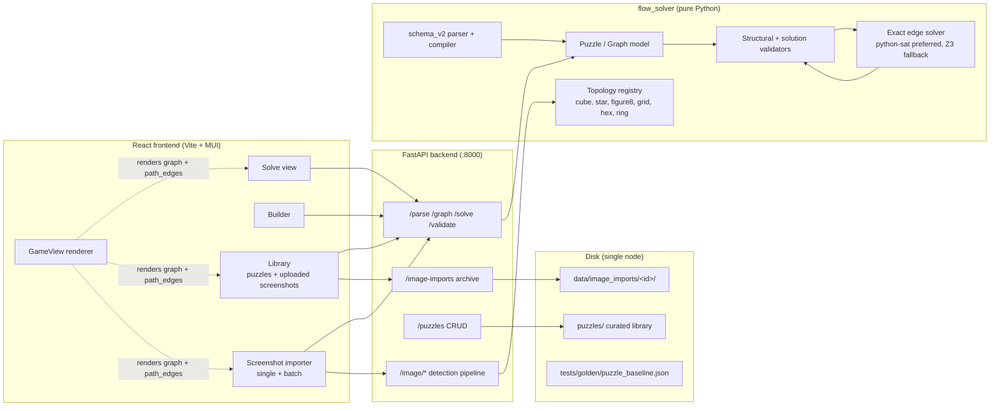

# Universal Flow Game Solver

A **Python + React** toolkit for solving *Flow / Numberlink*-style puzzles on **arbitrary graph spaces**:

- **Square/rectangular grids** (with holes, walls, and bridges)
- **Hex grids** (6-neighbor adjacency)
- **Circular/ring boards** (radial + wrap-around connections)
- **Shaped surfaces** (cube, radial star, and linked figure-eight templates)
- **Warped/freeform graphs** (typed seams, warps, walls, and arbitrary adjacencies)

The exact solver models selected path edges directly, validates both inputs and
solutions, and provides interactive visualization. See
[Architecture](docs/ARCHITECTURE.md) for the diagrammed system map (solver
pipeline, screenshot detection, free-form region import, storage), and
[Flow variants and solver architecture](docs/FLOW_VARIANTS_AND_ARCHITECTURE.md)
for the product research, schema-v2 design, topology contracts, and performance
methodology.

---

## Quickstart (Docker)

The fastest way to get started is with Docker Compose. This launches both the **FastAPI backend** and the **React frontend** with hot reload enabled:

```bash
docker compose up
```

Once running:
- **Frontend UI**: http://localhost:5173
- **Backend API**: http://localhost:8000

To start only one service:

```bash
docker compose up api   # backend only
docker compose up ui    # frontend only
```

That's it! Open http://localhost:5173 to start creating and solving puzzles.

---

## Using the UI

The React UI centers on four destinations: **Import**, **Create**, **Library**, and **Batch**. On phones these stay reachable from a persistent bottom navigation bar.

### Import Screenshot

This is the default starting point. Choose a screenshot from Photos or Files, crop to the board, and press **Process screenshot**. The guided pipeline reports progress for board type, level name, cells, and color pairs, then offers **Open in solver** or **Save to library**. Detection controls remain available under Advanced settings.

The screenshot may be portrait, landscape, square, letterboxed, or ultrawide and may use any practical resolution. Auto-crop and the detectors normalize against the recovered puzzle bounds, provided the complete board remains visible and has enough pixels to distinguish its cell boundaries.

Every completed or failed processing run is archived under `data/image_imports/`. The **Screenshot library** on the Import tab can search and filter the retained corpus, reopen results, reprocess selected screenshots through the current pipeline, or delete selected source images. Reprocessing updates the stable archived sample instead of copying its source image and retains lightweight summaries of prior runs. Set `FLOW_IMAGE_IMPORTS_DIR` to move this durable archive elsewhere.

### New Puzzle Tab

Build puzzles interactively with a visual grid editor:

1. **Choose a space type**:
   - `square` — standard grid with 4-neighbor adjacency
   - `hex` — hexagonal grid with 6-neighbor adjacency
   - `circle` — concentric rings with radial + wrap-around connections

2. **Set dimensions** (width × height, or rings × sectors for circle)

3. **Place terminal pairs**: Select a color (A–J) from the palette, then click cells to place terminals. Each color must have **exactly 2** endpoints.

4. **Load into editor** or **Save to library** when ready.

The "Image Import" panel on the right lets you upload a screenshot and auto-detect the grid/terminals (see below).

### Bulk Import Tab

Process multiple puzzle images at once:

1. **Select images** — add one or more screenshots
2. **Choose a crop template** — reusable presets for specific devices/screenshots
3. **Configure the pipeline**:
   - **OCR**: detect level name from the image
   - **Grid**: auto-detect grid dimensions
   - **Terminals**: auto-detect colored dot positions and preserve their sampled screenshot colors in the builder, solver, archive, and saved puzzle
4. **Run pipeline** — processes all images in batch
5. **Review and save** — edit names, check for duplicates, and save to library

Advanced settings let you tune thresholds for grid line detection, terminal color detection, perspective correction, and more.

### Library Tab

Browse all saved puzzles (both user-created and built-in examples):

- **Thumbnails** show puzzle previews
- Click a puzzle to load it into the **Solve View**
- Filter by type, size, or search by name

### Solve View

After loading a puzzle (from any tab), you enter the Solve View:

1. **Edit the puzzle text** directly if needed
2. **Choose a solver**:
   - `Z3 (exact)` — explicit edge-path model compiled to native SAT when PySAT is available, with a pure-Z3 fallback
   - `DFS` — depth-first search (experimental)
3. **Set timeout** (default 30 seconds)
4. Click **Solve** to find a solution
5. View the **graph preview** with solution overlay (toggle on/off)
6. **Save to library** with optional metadata (title, author, difficulty, tags)

Toggle **Plotly view** for interactive 2D/3D graph visualization.

---

## Puzzle Types

### Square Grid

The classic Flow Free board. Cells have 4 neighbors (up/down/left/right).

Special tiles:
- `.` — empty cell
- `#` — hole (blocked)
- `+` — bridge (allows paths to cross without connecting)
- `A-Z` — terminal dots (each letter appears exactly twice)

```text
# type: square
# fill: true
A...B
..#..
..+..
..#..
B...A
```

### Hex Grid

Hexagonal cells with 6-neighbor adjacency (odd-r offset layout).

```text
# type: hex
A.B
...
B.A
```

### Circle/Ring Board

Concentric rings where each row is a ring. Cells connect radially between rings and wrap around within each ring.

```text
# type: circle
# core: true
A.B.C.D.
........
........
D.C.B.A.
```

Set `# core: true` to add a center node connected to the innermost ring.

### Freeform Graph (JSON)

For arbitrary topologies, use JSON:

```json
{
  "space": {
    "type": "graph",
    "nodes": {
      "n0": { "pos": [0, 0] },
      "n1": { "pos": [1, 0] },
      "n2": { "pos": [2, 0] }
    },
    "edges": [
      ["n0", "n1"],
      ["n1", "n2"]
    ],
    "edge_overrides": {
      "add": [["n0", "n2"]],
      "remove": [["n1", "n2"]]
    },
    "warps": [["n0", "n2"]],
    "walls": [["n1", "n2"]]
  },
  "terminals": {
    "A": ["n0", "n2"]
  }
}
```

---

## Image Import Pipeline

The UI can extract puzzles from screenshots:

1. **Upload an image** (e.g., a Flow Free screenshot)
2. **Crop** to the puzzle area (or use auto-crop / saved templates)
3. **Run the pipeline**:
   - **OCR** detects level names/numbers (requires Tesseract)
   - **Grid detection** finds row/column lines
   - **Terminal detection** locates colored dots and assigns letters
   - **Warp detection** recovers the real lattice inside the one-cell shadow border, ignores duplicated shadow terminals, and emits only open opposite-edge gates
   - **Region topology** derives cells and adjacencies directly from non-rectangular shaped boards
   - **Bridge detection** recognizes legacy crosses and the official double-rail/double-arch glyph, then creates independent horizontal and vertical channels
4. **Review the result** and open it directly in the solver, or apply it to the manual builder for corrections
5. **Save** the generated puzzle to the searchable library

Completed and failed processing attempts retain their source screenshot in the import archive. Failed entries include the pipeline stage and error so future detector improvements can be tested against the original sample.

### OCR Setup (Optional)

Install Tesseract for level name detection:
- **Windows**: https://github.com/UB-Mannheim/tesseract/wiki
- **macOS**: `brew install tesseract`
- **Ubuntu**: `sudo apt-get install tesseract-ocr`

Set `TESSERACT_CMD` environment variable if Tesseract isn't in your PATH.

### Acceleration

`FLOW_ACCELERATOR=auto` is the default. A CUDA-capable OpenCV build is preferred; otherwise a CUDA-enabled PyTorch installation supplies cached GPU grayscale staging for detection and image annotation. `FLOW_ACCELERATOR=cpu` forces the deterministic CPU path, while `FLOW_ACCELERATOR=cuda` requests CUDA with safe CPU fallbacks for unavailable kernels.

Exact solving uses bundled native CPU SAT engines (Maple/CaDiCaL selected by topology), because Z3 and the supported exact SAT engines do not expose a CUDA backend. `GET /capabilities` and solve statistics report that distinction explicitly. Set `FLOW_DISABLE_PYSAT=1` to use the pure-Z3 diagnostic fallback.

---

## Manual Setup (Without Docker)

### Backend API

```bash
python app.py
```

Or with `uv`:

```bash
uv sync
uv run python app.py
```

Windows note (avoids file-lock issues on external drives):

```bash
uv --cache-dir .uv-cache sync --link-mode=copy
uv --cache-dir .uv-cache run --link-mode=copy python app.py
```

Environment variables:
- `HOST` (default `0.0.0.0`)
- `PORT` (default `8000`)
- `RELOAD` (default `1`)

### Frontend

```bash
cd frontend
npm install
npm run dev
```

The UI runs at http://localhost:5173 and talks to the API at http://localhost:8000.

---

## CLI (Headless)

Solve puzzles from the command line without the UI:

```bash
# Create a virtual environment
python -m venv .venv
.\.venv\Scripts\python -m pip install -r requirements.txt

# Solve a puzzle
.\.venv\Scripts\python -m flow_solver solve puzzles/square/5x5/classic_level_1.flow --out out/solution.html

# Visualize the graph (no solving)
.\.venv\Scripts\python -m flow_solver visualize puzzles/square/5x5/classic_level_1.flow --out out/graph.html

# Validate structure and prove solvability
.\.venv\Scripts\python -m flow_solver validate puzzles/square/5x5/classic_level_1.flow --solve --json

# Migrate a legacy puzzle to deterministic canonical schema-v2 JSON
.\.venv\Scripts\python -m flow_solver migrate puzzles/square/5x5/classic_level_1.flow --out out/classic_level_1.json

# Benchmark representative stored levels (5x5 through 15x15)
.\.venv\Scripts\python scripts/benchmark_solver.py
```

Open the generated `.html` file in your browser.

---

## Puzzle File Format (`.flow`)

A simple ASCII format with directives and grid data.

### Directives

Lines starting with `# key: value` set metadata:

| Directive | Description |
|-----------|-------------|
| `# type: square` | Square grid (4-neighbor) |
| `# type: hex` | Hex grid (6-neighbor) |
| `# type: circle` | Circular rings |
| `# fill: true` | Require all cells to be filled |
| `# core: true` | Add center node for circle boards |

### Cell Symbols

| Symbol | Meaning |
|--------|---------|
| `.` | Empty cell |
| `#` | Hole (no node) |
| `+` | Bridge (2 channels) |
| `A-Z` | Terminal (must appear exactly twice) |

### Curated puzzle corpus

Release-quality sample puzzles live under `puzzles/`, organized by geometry and size. The corpus includes classic square and circle boards plus screenshot-verified bridge, warp, wall, and irregular-region levels. Deliberately trivial mechanic POCs are kept in focused automated tests instead of appearing in the user-facing library.

---

## API Endpoints

### Puzzle Operations

| Endpoint | Description |
|----------|-------------|
| `GET /puzzles` | List all puzzles |
| `POST /puzzles` | Save a new puzzle |
| `POST /solve` | Solve a puzzle |
| `POST /parse` | Parse and validate |
| `POST /validate` | Return structural validation issues and statistics |
| `POST /graph` | Build graph from text |
| `GET /capabilities` | Report CUDA/image and exact-solver acceleration backends |

### Image Processing

| Endpoint | Description |
|----------|-------------|
| `POST /image/crop/auto` | Auto-detect crop region |
| `POST /image/classify` | Classify geometry/mode (square/hex/circle/graph + modifiers) |
| `POST /image/grid/detect` | Detect grid dimensions |
| `POST /image/terminals/detect` | Detect terminal positions |
| `POST /image/generate` | Generate puzzle from image |
| `POST /image/ocr` | Extract text from image |

### Screenshot Archive

| Endpoint | Description |
|----------|-------------|
| `GET /image-imports?limit=1000` | List retained screenshot samples and latest outcomes |
| `GET /image-imports/{id}` | Read a sample, its latest result, and prior run summaries |
| `GET /image-imports/{id}/image` | Read the retained source screenshot |
| `POST /image-imports/{id}/failure` | Record an in-place reprocessing failure |
| `POST /image-imports/bulk-delete` | Delete selected screenshot samples |
| `DELETE /image-imports/{id}` | Delete one screenshot sample |

### Crop Templates

| Endpoint | Description |
|----------|-------------|
| `GET /templates/crop` | List saved templates |
| `POST /templates/crop` | Save a new template |
| `GET /templates/crop/{id}/preview` | Template preview image |
| `DELETE /templates/crop/{id}` | Delete a template |

---

## Format and architecture

Legacy `.flow` and graph JSON remain supported. New integrations should prefer
canonical schema v2 (`format: flow-solver-puzzle`, `schema_version: 2`), which
separates physical cells, routing channels, typed port adjacencies, display
geometry, rules, and catalog provenance. This is what allows bridges, seams,
warps, and shaped boards to share one solver without topology-specific logic.

### Architecture at a glance

The full, diagrammed system map lives in [docs/ARCHITECTURE.md](docs/ARCHITECTURE.md)
(also readable in-app via the **Docs** button), covering the universal puzzle
model, the exact solver, screenshot detection, free-form region import,
storage, and the single-node concurrency model. The bird's-eye view:



Highlights, each diagrammed in the architecture doc:

- **One model for every variant** — a level is physical cells, routing
  channels, and typed port adjacencies (`local`/`seam`/`warp`, `open`/`blocked`);
  square, hex, circle, bridges, walls, warps, and shaped boards are all
  instances of it.
- **Exact solving with lazy connectivity** — a Boolean edge model solved by a
  native SAT engine (Z3 fallback), with stray cycles removed by incremental
  cut-set constraints, and every solution re-verified by an independent
  validator before it is returned.
- **Evidence-driven screenshot import** — auto-crop, classification, grid or
  region detection, terminal clustering, and bridge/wall/warp detectors; every
  upload is archived and can be bulk-reprocessed as the pipeline improves.
- **Regression safety** — `scripts/validate_puzzles.py` re-solves the whole
  library (and optionally the archive) against a golden baseline, and
  `scripts/benchmark_solver.py` tracks solve-time drift.
