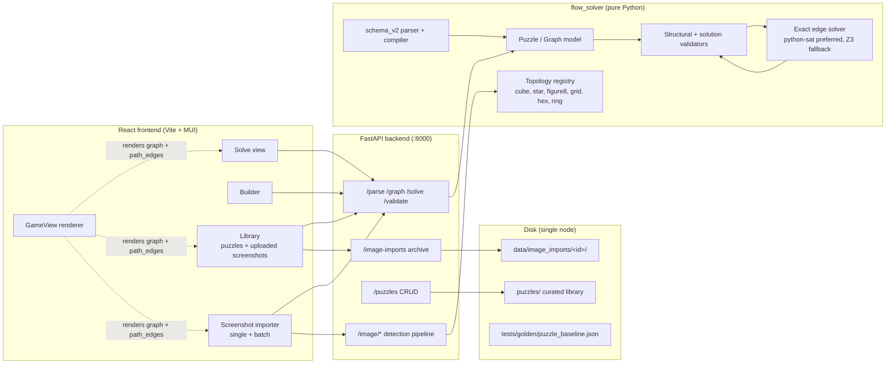

# Universal Flow Game Solver

A **Python + React** toolkit for solving *Flow / Numberlink*-style puzzles on **arbitrary graph spaces**:

- **Square/rectangular grids** (with holes, walls, and bridges)
- **Hex grids** (6-neighbor adjacency)
- **Circular/ring boards** (radial + wrap-around connections)
- **Shaped surfaces** (cube, radial star, and linked figure-eight templates)
- **Warped/freeform graphs** (typed seams, warps, walls, and arbitrary adjacencies)

The exact solver models selected path edges directly, validates both inputs and
solutions, and provides interactive visualization. See
[Architecture](docs/ARCHITECTURE.md) for the diagrammed system map (solver
pipeline, screenshot detection, free-form region import, storage), and
[Flow variants and solver architecture](docs/FLOW_VARIANTS_AND_ARCHITECTURE.md)
for the product research, schema-v2 design, topology contracts, and performance
methodology.

---

## Quickstart (Docker)

The fastest way to get started is with Docker Compose. This launches both the **FastAPI backend** and the **React frontend** with hot reload enabled:

```bash
docker compose up
```

Once running:
- **Frontend UI**: http://localhost:5173
- **Backend API**: http://localhost:8000

To start only one service:

```bash
docker compose up api   # backend only
docker compose up ui    # frontend only
```

That's it! Open http://localhost:5173 to start creating and solving puzzles.

For the same-origin, supervised production layout, set the public origin and
use the production Compose file:

```bash
PUBLIC_ORIGIN=https://flow.example.com docker compose -f docker-compose.prod.yml up -d --build
```

See [Production readiness](docs/PRODUCTION_READINESS.md) for backup, validation,
and restore checks.

---

## Using the UI

The React UI centers on four destinations: **Screenshot**, **Create**,
**Library**, and **Flagged**. Single-image and durable background batch import
are modes of the Screenshot page. On phones these stay reachable from a
persistent bottom navigation bar.

### Import a Screenshot or Camera Photo

This is the default starting point. Choose **Screenshot**, **Camera photo**, or
**Detect automatically**, select an image, and press **Process image**.
The camera button selects Camera photo automatically. The guided pipeline
reports progress for board type, level name, cells, and color pairs, then
offers **Open in solver** or **Save to library**. Detection controls remain
available under Advanced settings.

The screenshot may be portrait, landscape, square, letterboxed, or ultrawide and may use any practical resolution. Auto-crop and the detectors normalize against the recovered puzzle bounds, provided the complete board remains visible and has enough pixels to distinguish its cell boundaries.

Camera mode is a separate preparation path, so it does not change screenshot
processing. It applies EXIF orientation, finds and rectifies the photographed
display and inner board, uses separate geometry and color views, masks glare,
and then hands the prepared board to the established detectors. The detected
screen outline and rectified preview are shown before processing. If the
outline is wrong, choose **Adjust screen corners**, drag all four handles, and
preview the correction without uploading again.

For reliable camera imports, keep all four display corners visible, fill a
reasonable part of the frame, and make sure grid boundaries and colored dots
remain visually distinguishable. Mild blur and moderate off-angle capture are
supported. Significant glare, blur that is large relative to the board's cells,
cells too small in the photo, a prepared board below 400 pixels on its short
side, or an ambiguous or uncorroborated screen outline produces a durable review
flag and retake guidance instead of a high-confidence result. Automatically
detected corners are only a starting point: the server keeps treating them as
automatic until you drag a handle or choose **Use these corners**.

Camera uploads are archived with location and device metadata removed; JPEG
and PNG files are rewritten losslessly and keep only their orientation.
`auto` mode takes the camera path when the file carries camera EXIF metadata,
or, for images without it (for example photos forwarded through a messaging
app), when the screenshot path cannot find a regular grid but the camera path
finds a confident board inside a tilted, corroborated screen outline. HEIC/HEIF
photos are decoded with `pillow-heif`.

The browser uploads each image once per import (`POST /image/uploads`) and
the later pipeline stages reference it by content hash. Uploads live in
`data/.image_uploads/` (`FLOW_IMAGE_UPLOADS_DIR`) and expire after 30 minutes
(`FLOW_IMAGE_UPLOAD_TTL_SECONDS`).

Every completed or failed processing run is archived under `data/image_imports/`. The **Uploaded screenshots** section in Library can search and filter the retained corpus, reopen results, reprocess selected screenshots through the current pipeline, or delete selected source images. Reprocessing updates the stable archived sample instead of copying its source image and retains lightweight summaries of prior runs. A rebuildable SQLite summary index keeps archive filtering and pagination fast while `record.json` remains authoritative. Set `FLOW_IMAGE_IMPORTS_DIR` to move this durable archive elsewhere.

Any archived screenshot can be **flagged for review**, with an optional note,
from the batch results, Uploaded screenshots, or its Solve View. Incomplete
terminal detection and archived solve failures are flagged automatically. The
dedicated **Flagged** destination shows the retained input image,
processing/solve errors, completeness evidence, and stored solution together.
Unflag an entry when follow-up is complete.

### New Puzzle Tab

Build puzzles interactively with a visual grid editor:

1. **Choose a space type**:
   - `square` — standard grid with 4-neighbor adjacency
   - `hex` — hexagonal grid with 6-neighbor adjacency
   - `circle` — concentric rings with radial + wrap-around connections

2. **Set dimensions** (width × height, or rings × sectors for circle)

3. **Place terminal pairs**: Select a color (A–J) from the palette, then click cells to place terminals. Each color must have **exactly 2** endpoints.

4. **Load into editor** or **Save to library** when ready.

The "Image Import" panel on the right lets you upload a screenshot and auto-detect the grid/terminals (see below).

### Screenshot Batch Mode

Process multiple puzzle images at once:

1. **Select images** — add one or more screenshots
2. **Choose a crop template** — reusable presets for specific devices/screenshots
3. **Configure the pipeline**:
   - **OCR**: detect the level name and advertised `flows: 0/N` count
   - **Grid**: auto-detect grid dimensions
   - **Terminals**: auto-detect colored and high-contrast neutral/gray dot positions, preserve their sampled screenshot colors, and compare detected pairs with the OCR flow count
4. **Start background batch** — persists sources and work under
   `data/image_jobs/`; the browser may disconnect and resume status later
5. **Review and save** — edit names, check for duplicates, and save to library

Advanced settings let you tune thresholds for grid line detection, terminal color detection, perspective correction, and more.

### Library Tab

Browse all saved puzzles (both user-created and built-in examples):

- **Thumbnails** show puzzle previews
- Click a puzzle to load it into the **Solve View**
- Filter by type, size, or search by name

### Solve View

After loading a puzzle (from any tab), you enter the Solve View:

1. **Edit the puzzle text** directly if needed
2. **Set the exact-solver timeout** (default 30 seconds)
3. Click **Solve** to find a solution
4. Switch between the game-style board and lightweight graph preview
5. **Save to library** with optional metadata (title, author, difficulty, tags)

The exact edge-path model compiles to native SAT when PySAT is available and
uses pure Z3 as its fallback.

---

## Puzzle Types

### Square Grid

The classic Flow Free board. Cells have 4 neighbors (up/down/left/right).

Special tiles:
- `.` — empty cell
- `#` — hole (blocked)
- `+` — bridge (allows paths to cross without connecting)
- `A-Z` — terminal dots (each letter appears exactly twice)

```text
# type: square
# fill: true
A...B
..#..
..+..
..#..
B...A
```

### Hex Grid

Hexagonal cells with 6-neighbor adjacency (odd-r offset layout).

```text
# type: hex
A.B
...
B.A
```

### Circle/Ring Board

Concentric rings where each row is a ring. Cells connect radially between rings and wrap around within each ring.

```text
# type: circle
# core: true
A.B.C.D.
........
........
D.C.B.A.
```

Set `# core: true` to add a center node connected to the innermost ring.

### Freeform Graph (JSON)

For arbitrary topologies, use JSON:

```json
{
  "space": {
    "type": "graph",
    "nodes": {
      "n0": { "pos": [0, 0] },
      "n1": { "pos": [1, 0] },
      "n2": { "pos": [2, 0] }
    },
    "edges": [
      ["n0", "n1"],
      ["n1", "n2"]
    ],
    "edge_overrides": {
      "add": [["n0", "n2"]],
      "remove": [["n1", "n2"]]
    },
    "warps": [["n0", "n2"]],
    "walls": [["n1", "n2"]]
  },
  "terminals": {
    "A": ["n0", "n2"]
  }
}
```

---

## Image Import Pipeline

The UI can extract puzzles from screenshots and photographs of another screen:

1. **Upload an image** and select Screenshot, Camera photo, or Detect automatically
2. **Prepare the board** with screenshot crop/templates or camera display rectification and optional four-corner correction
3. **Run the pipeline**:
   - **OCR** detects level names/numbers and the advertised flow count (requires Tesseract)
   - **Grid detection** finds row/column lines
   - **Terminal detection** locates colored and neutral/gray dots, retains near-miss diagnostics, assigns letters, and reports pair completeness
   - **Warp detection** recovers the real lattice inside the one-cell shadow border, ignores duplicated shadow terminals, and emits only open opposite-edge gates
   - **Region topology** derives cells and adjacencies directly from non-rectangular shaped boards
   - **Bridge detection** recognizes legacy crosses and the official double-rail/double-arch glyph, then creates independent horizontal and vertical channels
4. **Review the result** and open it directly in the solver, or apply it to the manual builder for corrections
5. **Save** the generated puzzle to the searchable library

Completed and failed processing attempts retain their source image in the
import archive. Failed entries include the pipeline stage and error so future
detector improvements can be tested against the original sample. When OCR
provides an expected flow count, an incomplete exact generated artifact is
flagged and cannot be recorded as solved until it is reviewed or corrected.

Camera-photo regression tooling is documented in
[`reference_camera_corpus/README.md`](reference_camera_corpus/README.md). The
synthetic gate adds perspective, blur, JPEG loss, glare, and display banding to
reviewed screenshots, then compares puzzle structure rather than unstable
sampled RGB values.

### OCR Setup (Optional)

Install Tesseract for level name detection:
- **Windows**: https://github.com/UB-Mannheim/tesseract/wiki
- **macOS**: `brew install tesseract`
- **Ubuntu**: `sudo apt-get install tesseract-ocr`

Set `TESSERACT_CMD` environment variable if Tesseract isn't in your PATH.

### Acceleration

`FLOW_ACCELERATOR=auto` is the default. A CUDA-capable OpenCV build is preferred; otherwise a CUDA-enabled PyTorch installation supplies cached GPU grayscale staging for detection and image annotation. `FLOW_ACCELERATOR=cpu` forces the deterministic CPU path, while `FLOW_ACCELERATOR=cuda` requests CUDA with safe CPU fallbacks for unavailable kernels.

Exact solving uses bundled native CPU SAT engines (Maple/CaDiCaL selected by topology), because Z3 and the supported exact SAT engines do not expose a CUDA backend. `GET /capabilities` and solve statistics report that distinction explicitly. Set `FLOW_DISABLE_PYSAT=1` to use the pure-Z3 diagnostic fallback.

---

## Manual Setup (Without Docker)

### Backend API

```bash
python app.py
```

Or with `uv`:

```bash
uv sync
uv run python app.py
```

Windows note (avoids file-lock issues on external drives):

```bash
uv --cache-dir .uv-cache sync --link-mode=copy
uv --cache-dir .uv-cache run --link-mode=copy python app.py
```

Environment variables:
- `HOST` (default `0.0.0.0`)
- `PORT` (default `8000`)
- `RELOAD` (default `1`)

### Frontend

```bash
cd frontend
npm install
npm run dev
```

The UI runs at http://localhost:5173 and talks to the API at http://localhost:8000.

---

## CLI (Headless)

Solve puzzles from the command line without the UI:

```bash
# Create a virtual environment
python -m venv .venv
.\.venv\Scripts\python -m pip install -r requirements.txt

# Solve a puzzle
.\.venv\Scripts\python -m flow_solver solve puzzles/square/5x5/classic_level_1.flow --out out/solution.html

# Visualize the graph (no solving)
.\.venv\Scripts\python -m flow_solver visualize puzzles/square/5x5/classic_level_1.flow --out out/graph.html

# Validate structure and prove solvability
.\.venv\Scripts\python -m flow_solver validate puzzles/square/5x5/classic_level_1.flow --solve --json

# Migrate a legacy puzzle to deterministic canonical schema-v2 JSON
.\.venv\Scripts\python -m flow_solver migrate puzzles/square/5x5/classic_level_1.flow --out out/classic_level_1.json

# Benchmark representative stored levels (5x5 through 15x15)
.\.venv\Scripts\python scripts/benchmark_solver.py
```

Open the generated `.html` file in your browser.

---

## Puzzle File Format (`.flow`)

A simple ASCII format with directives and grid data.

### Directives

Lines starting with `# key: value` set metadata:

| Directive | Description |
|-----------|-------------|
| `# type: square` | Square grid (4-neighbor) |
| `# type: hex` | Hex grid (6-neighbor) |
| `# type: circle` | Circular rings |
| `# fill: true` | Require all cells to be filled |
| `# core: true` | Add center node for circle boards |

### Cell Symbols

| Symbol | Meaning |
|--------|---------|
| `.` | Empty cell |
| `#` | Hole (no node) |
| `+` | Bridge (2 channels) |
| `A-Z` | Terminal (must appear exactly twice) |

### Curated puzzle corpus

Release-quality sample puzzles live under `puzzles/`, organized by geometry and size. The corpus includes classic square and circle boards plus screenshot-verified bridge, warp, wall, and irregular-region levels. Deliberately trivial mechanic POCs are kept in focused automated tests instead of appearing in the user-facing library.

---

## API Endpoints

### Puzzle Operations

| Endpoint | Description |
|----------|-------------|
| `GET /puzzles` | List all puzzles |
| `POST /puzzles` | Save a new puzzle |
| `POST /solve` | Solve a puzzle |
| `POST /parse` | Parse and validate |
| `POST /validate` | Return structural validation issues and statistics |
| `POST /graph` | Build graph from text |
| `GET /capabilities` | Report CUDA/image and exact-solver acceleration backends |

### Image Processing

| Endpoint | Description |
|----------|-------------|
| `POST /image/crop/auto` | Auto-detect crop region |
| `POST /image/classify` | Classify geometry/mode (square/hex/circle/graph + modifiers) |
| `POST /image/grid/detect` | Detect grid dimensions |
| `POST /image/terminals/detect` | Detect terminal positions |
| `POST /image/generate` | Generate puzzle from image |
| `POST /image/ocr` | Extract text from image |
| `POST /image/jobs` | Submit a durable background image batch |
| `GET /image/jobs` | List durable jobs |
| `GET /image/jobs/{id}` | Read job progress and per-image results |
| `GET /image/jobs/{id}/items/{index}/image` | Recover a retained job source after reconnecting |
| `POST /image/jobs/{id}/retry` | Retry failed work in a retained job |

### Screenshot Archive

| Endpoint | Description |
|----------|-------------|
| `GET /image-imports?limit=100&offset=0` | Paginated samples; supports status/search/order and `flagged=true\|false` filters |
| `GET /image-imports/{id}` | Read a sample, its latest result, and prior run summaries |
| `GET /image-imports/{id}/image` | Read the retained source screenshot |
| `POST /image-imports/{id}/failure` | Record an in-place reprocessing failure |
| `POST /image-imports/{id}/flag` | Flag a sample for review; accepts an optional JSON `reason` |
| `DELETE /image-imports/{id}/flag` | Clear a sample's review flag and note |
| `POST /image-imports/bulk-delete` | Delete selected screenshot samples |
| `DELETE /image-imports/{id}` | Delete one screenshot sample |

### Crop Templates

| Endpoint | Description |
|----------|-------------|
| `GET /templates/crop` | List saved templates |
| `POST /templates/crop` | Save a new template |
| `GET /templates/crop/{id}/preview` | Template preview image |
| `DELETE /templates/crop/{id}` | Delete a template |

---

## Format and architecture

Legacy `.flow` and graph JSON remain supported. New integrations should prefer
canonical schema v2 (`format: flow-solver-puzzle`, `schema_version: 2`), which
separates physical cells, routing channels, typed port adjacencies, display
geometry, rules, and catalog provenance. This is what allows bridges, seams,
warps, and shaped boards to share one solver without topology-specific logic.

### Architecture at a glance

The full, diagrammed system map lives in [docs/ARCHITECTURE.md](docs/ARCHITECTURE.md)
(also readable in-app via the **Docs** button), covering the universal puzzle
model, the exact solver, screenshot detection, free-form region import,
storage, and the single-node concurrency model. The bird's-eye view:


```mermaid
flowchart LR
    subgraph Frontend["React frontend (Vite + MUI)"]
        SV[Solve view]
        NV[Builder]
        IV[Screenshot importer<br/>single + batch]
        LV[Library<br/>puzzles + uploaded screenshots]
        GV[GameView renderer]
    end

    subgraph Backend["FastAPI backend (:8000)"]
        API["/parse /graph /solve /validate"]
        IMG["/image/* detection pipeline"]
        LIB["/puzzles CRUD"]
        ARC["/image-imports archive"]
    end

    subgraph Core["flow_solver (pure Python)"]
        P[Puzzle / Graph model]
        S2[schema_v2 parser + compiler]
        SOL[Exact edge solver<br/>python-sat preferred, Z3 fallback]
        VAL[Structural + solution validators]
        TOP[Topology registry<br/>cube, star, figure8, grid, hex, ring]
    end

    subgraph Storage["Disk (single node)"]
        PUZ["puzzles/ curated library"]
        IMP["data/image_imports/&lt;id&gt;/"]
        GOLD["tests/golden/puzzle_baseline.json"]
    end

    SV & NV & IV & LV --> API
    IV --> IMG
    LV --> ARC
    API --> P
    IMG --> TOP
    S2 --> P
    P --> VAL --> SOL --> VAL
    LIB --> PUZ
    ARC --> IMP
    GV -. "renders graph + path_edges" .-> SV & LV & IV
```

Highlights, each diagrammed in the architecture doc:

- **One model for every variant** — a level is physical cells, routing
  channels, and typed port adjacencies (`local`/`seam`/`warp`, `open`/`blocked`);
  square, hex, circle, bridges, walls, warps, and shaped boards are all
  instances of it.
- **Exact solving with topology preprocessing** — a Boolean edge model solved
  by a native SAT engine (Z3 fallback), with cached bridge/articulation pruning
  and lazy connectivity cuts as a backstop; every solution is re-verified by
  an independent validator before it is returned.
- **Evidence-driven screenshot import** — auto-crop, classification, grid or
  region detection, terminal clustering, and bridge/wall/warp detectors; every
  upload is archived and can be bulk-reprocessed as the pipeline improves.
- **Regression safety** — `scripts/validate_puzzles.py` re-solves the whole
  library (and optionally the archive) against a golden baseline, and
  `scripts/benchmark_solver.py` fails CI on material solve-time or model-size
  drift.

For source-image regression testing, `reference_screenshot_corpus/` is the
persistent local set. It can hold up to 500 SHA-256-unique screenshots and
balances selection across geometry, modifiers, grid sizes, and historical
outcomes:

```bash
python scripts/build_reference_corpus.py --limit 500
uv run --with httpx python scripts/replay_reference_corpus.py --jobs 3
```

The replay runs every selected screenshot through image generation and solving
and reports generated-puzzle, terminal-completeness, solve-outcome, and
failure-reason differences from its reviewed baseline. Recorded mode preserves
the original processing choices; `--mode auto` also tests current automatic
classification. This corpus is included in mutable-data backups but
deliberately is not required by CI.
