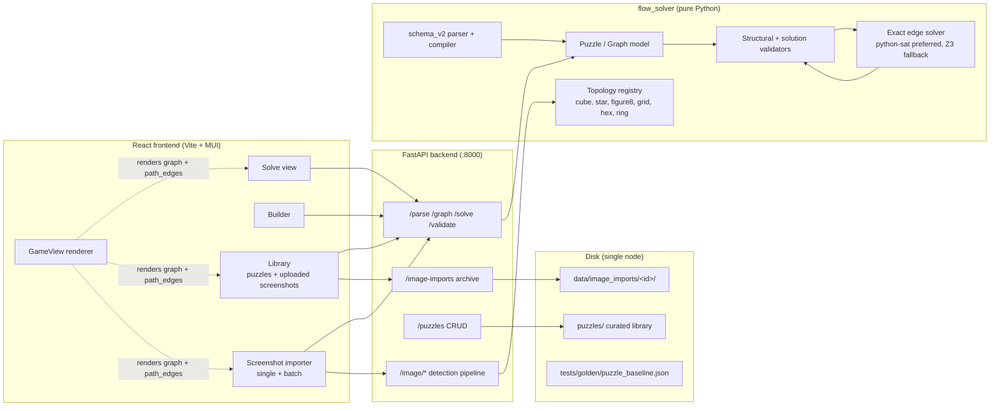
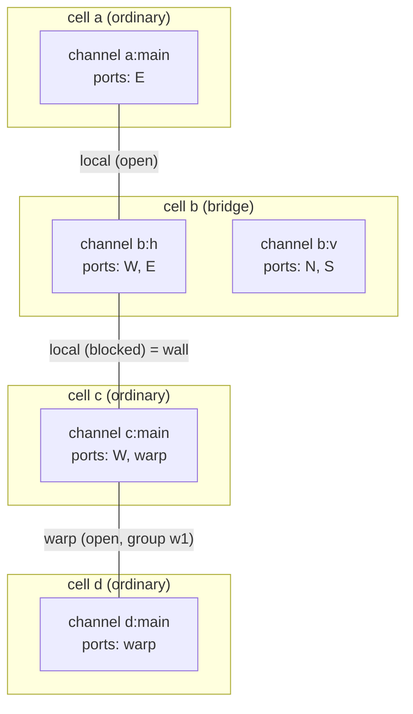
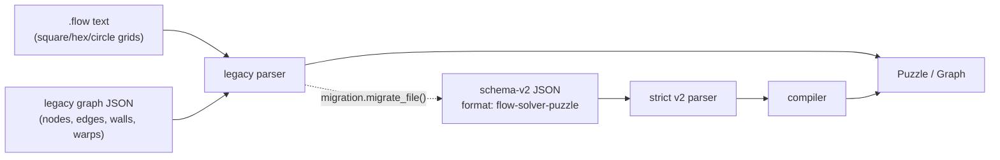
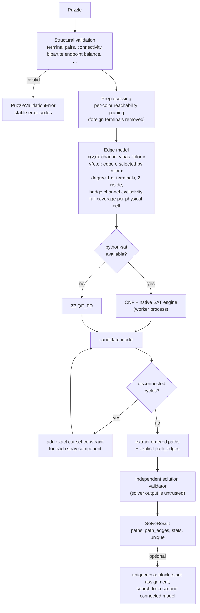
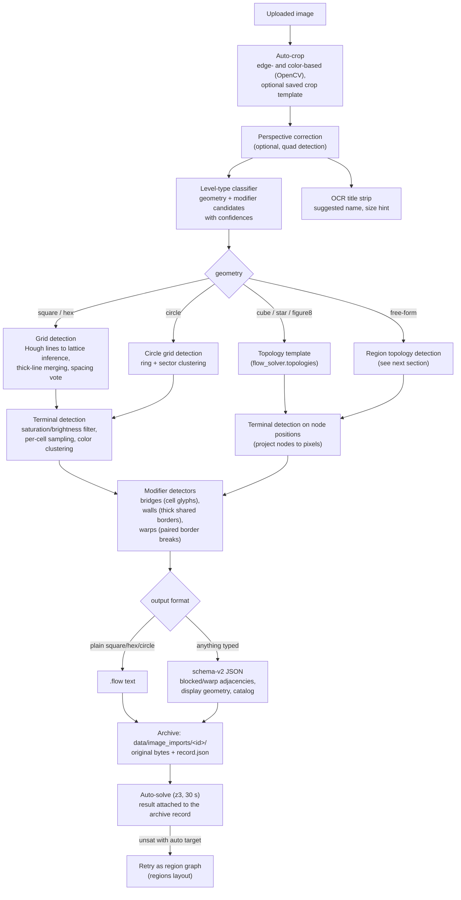
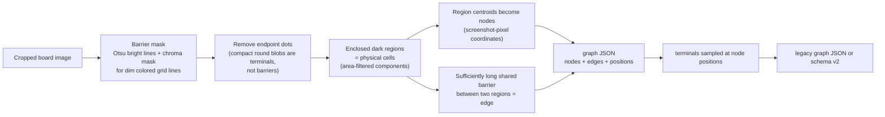
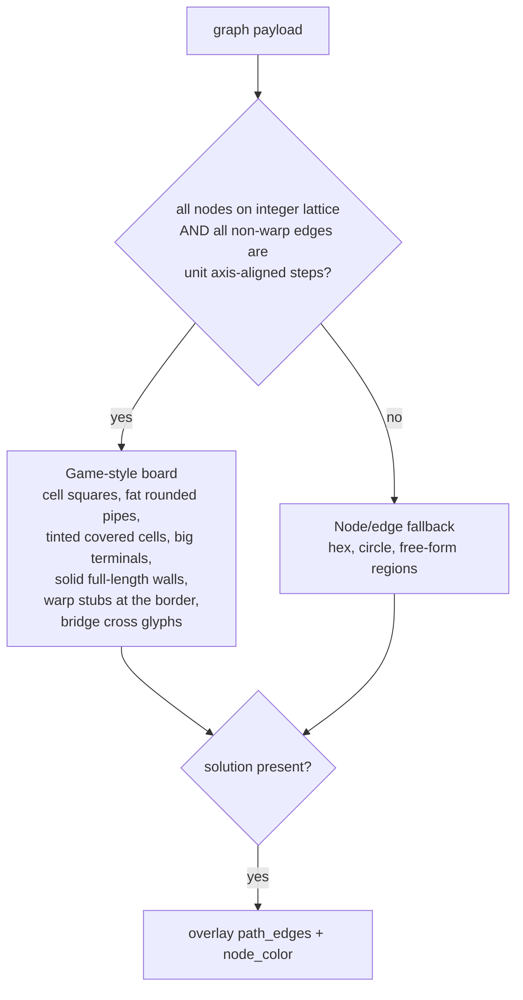
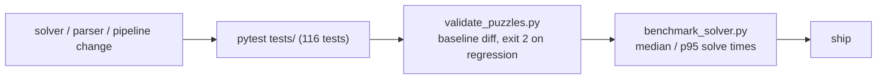

# Universal Flow Game Solver — architecture

This is the system-level map of the project: how a puzzle gets in (typed,
built, or photographed), how the universal model represents every Flow
variant on one graph abstraction, how the exact solver works, and where
everything is stored. For the deep dive on variant mechanics and the schema-v2
format, see [FLOW_VARIANTS_AND_ARCHITECTURE.md](FLOW_VARIANTS_AND_ARCHITECTURE.md);
for deployment posture, see [PRODUCTION_READINESS.md](PRODUCTION_READINESS.md).

## Bird's-eye view



One node runs everything. Solves and image detection are CPU-bound but escape
the GIL (Z3 via ctypes, python-sat in a worker process, PIL/NumPy internally),
so FastAPI's threadpool gives real multi-core parallelism without extra
processes.

## The universal puzzle model

A level is **not** a rectangular matrix. It is a set of *physical cells*, one
or more *routing channels* per cell, named *ports* on each channel, and typed
*adjacencies* between ports. Every product variant is an instance of that one
model:



| Variant | What changes | In the model |
| --- | --- | --- |
| Classic / Jumbo | board size only | 4-neighbor `local` adjacencies |
| Hexes | 6 neighbors | more `local` adjacencies per cell |
| Bridges | two pipes cross one cell | one cell, two channels (`:h`, `:v`) |
| Walls | a border can't be crossed | adjacency `state: "blocked"` |
| Warps | pipe exits and re-enters elsewhere | `warp` adjacency (never inferred from distance) |
| Wrap / boundless | opposite edges join | `seam` adjacency |
| Shapes (cube, star, figure-8, circle) | non-planar board | topology template or explicit region graph |

Three input formats compile into the same runtime `Puzzle`/`Graph`:



Schema v2 stays attached as `Puzzle.source_spec`, so the API and renderer keep
typed adjacencies, display geometry, and catalog provenance that the compact
solver graph doesn't need.

## Solver pipeline

The public "z3" solver is an exact Boolean edge model. When the optional
`python-sat` runtime is installed (it is, by default), the identical model is
compiled to CNF and solved by a native SAT engine in a separate worker
process; Z3 remains the fallback (`FLOW_DISABLE_PYSAT=1` forces it).



Key properties:

- **One deadline** covers validation, preprocessing, model build, every
  incremental check, extraction, and uniqueness.
- Degree constraints alone admit closed loops, so connectivity is enforced
  **lazily**: each candidate is component-checked and stray cycles are removed
  with exact cut-set clauses. This keeps the initial model far smaller than an
  all-pairs reachability encoding.
- Every returned solution is re-verified by an independent validator before it
  leaves the core — encoding or extraction bugs surface as errors, not wrong
  answers.
- Renderers must draw `path_edges`, never "all edges whose endpoints share a
  color".

Current single-node baseline (`scripts/benchmark_solver.py`): 5x5 ≈ 42 ms,
8x8 ≈ 16 ms, 10x10 ≈ 43 ms, 15x15 with 16 colors ≈ 405 ms median.

## Screenshot detection pipeline

The importer turns a phone screenshot into a solvable document. Every upload
is archived first, so any screenshot can be reprocessed through a newer
pipeline later.



Design rules the pipeline follows:

- **Evidence over inference.** A warp adjacency requires both members of the
  paired border-break glyph; distance, glow, or a pack name is never enough.
- **Detection settings are reproducible.** Crop templates store the crop
  rectangle *and* the pipeline toggles used, so a device's screenshots import
  the same way every time.
- **Failures are kept.** A failed import archives the original image plus the
  error and stage; the Library's *Uploaded screenshots* page can bulk-select
  and reprocess them after the pipeline improves. Each reprocess appends a run
  summary to the record (`runs[]`), preserving history.

## Free-form (region) detection

Shaped boards — the Shapes app's silhouettes, rings with holes, linked loops —
have no lattice to detect. The region path builds the graph directly from the
picture:



Two properties matter downstream:

- Node coordinates are **screenshot pixels**, not grid units. `GameView`
  detects this (no integer lattice) and falls back to node/edge rendering with
  a capped scale, while true grids get the game-style board.
- Known solids don't go through region detection at all:
  `flow_solver.topologies` generates cube/star/figure-8 boards from `(width,
  height)` parameters with stable ids, exact edges, and display positions, so
  those imports are deterministic.

## Frontend rendering

`GameView` is the single board renderer used by the solve view, library
thumbnails, batch results, and the archive's inline solutions:



Graph-theoretic views (static graph, Plotly 2D/3D) remain available as
advanced modes in the solve view.

## Storage and regression safety

Everything persists as plain files under the repository root — trivially
backed up, no database:

```text
puzzles/                       curated library (.flow / .json), organized kind/size
puzzles/templates/crop/        saved crop templates (+ preview.png)
data/image_imports/<id>/       source.<ext>  original screenshot bytes (immutable)
                               record.json   detection result, solve result, runs[]
tests/golden/puzzle_baseline.json   golden outcomes for every library puzzle
```

`scripts/validate_puzzles.py` re-solves every library puzzle (and with
`--include-imports` every archived generation), re-verifies each solution
independently, and diffs stable outcomes against the golden baseline —
regressions exit nonzero. `scripts/benchmark_solver.py` tracks solve-time
drift. Together they are the release gate:



## Concurrency model (single node)

| Layer | Mechanism |
| --- | --- |
| Frontend batch import | bounded pool, 3 screenshots in flight |
| FastAPI sync endpoints | threadpool workers |
| SAT solving | separate worker process (python-sat) or GIL-released ctypes (Z3) |
| Image ops | OpenCV/PIL/NumPy release the GIL internally |
| Archive record updates | atomic tmp-file rename + per-import `threading.Lock` |

The per-import locks are in-process; moving to multiple uvicorn workers
requires cross-process file locking first (tracked in
[PRODUCTION_READINESS.md](PRODUCTION_READINESS.md)).
